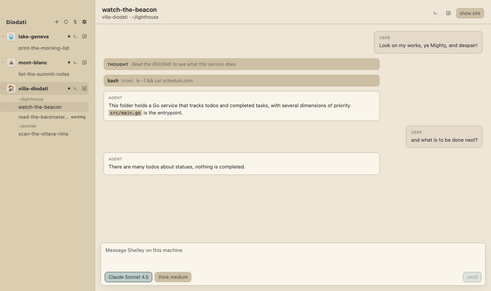

# Diodati

Diodati is a tool to manage Shelley conversations across your exe.dev machines.

It uses the SSH keys already on this computer. You do not set up extra sign-in.

## Download

[Download Diodati for macOS](https://github.com/alexhughson/diodati/releases/latest/download/Diodati-macOS.zip)

This is an Apple Silicon build.

You need macOS on Apple Silicon, an exe.dev account, and an SSH key that exe.dev already accepts.

## What you can do

- See the exe.dev machines this computer can reach
- Open Shelley conversations and keep talking
- Start a new machine without leaving the app
